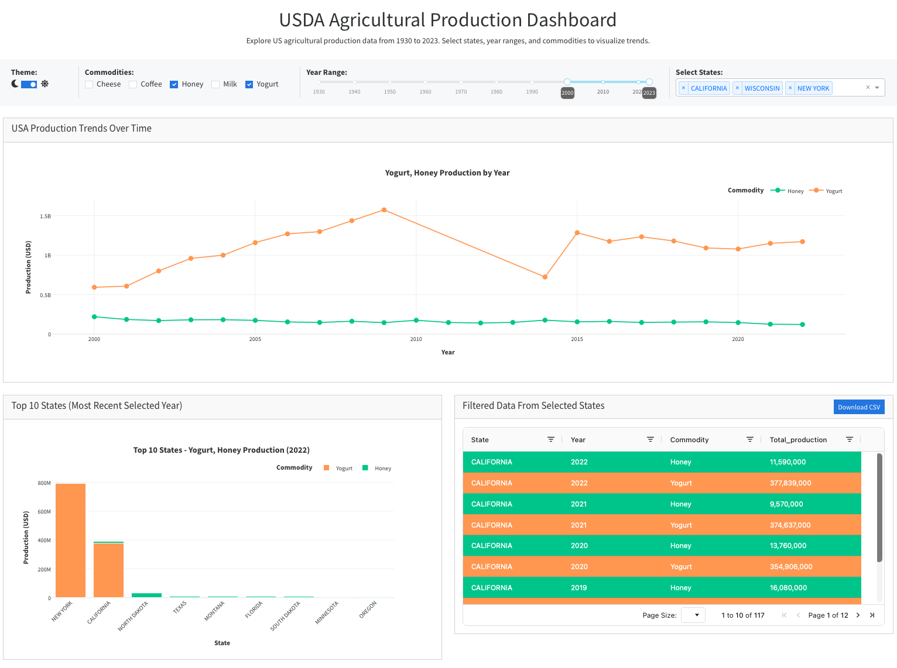
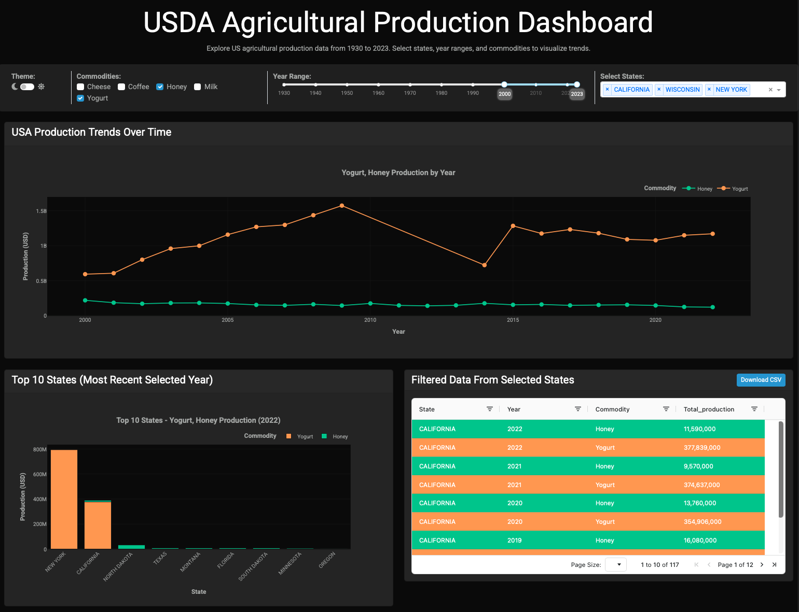

# USDA Agricultural Production Analysis

A comprehensive data science project analyzing USDA agricultural production data from 1930-2023. This project demonstrates end-to-end data pipeline skills including SQL data processing, Python analysis, and interactive dashboard visualization using Plotly and Dash.

## Dashboard Screenshots

### Light Theme


### Dark Theme


## Project Structure

```
data-science-pofolio/
├── SQL/
│   ├── project-USDA.sqlite              # SQLite database
│   ├── load_and_examine_USDA_data.sql   # SQL analysis queries
│   ├── USDA_production_2023.csv         # Processed data for dashboard
│   ├── state_lookup.csv                 # State ANSI code reference
│   ├── milk_production.csv              # Raw milk data
│   ├── cheese_production.csv            # Raw cheese data
│   ├── honey_production.csv             # Raw honey data
│   ├── coffee_production.csv            # Raw coffee data
│   └── yogurt_production.csv            # Raw yogurt data
├── dashboard/
│   ├── app.py                           # Dash web application
│   └── requirements.txt                 # Python dependencies
└── README.md
```

## Input Data

### Data Source
USDA (United States Department of Agriculture) agricultural production statistics spanning 1930 to 2023.

### Raw Data Files

| Dataset | Records | Description |
|---------|---------|-------------|
| `milk_production.csv` | 37,639 | Monthly milk production by state |
| `cheese_production.csv` | 7,488 | Cheese production data |
| `honey_production.csv` | 1,560 | Annual honey production |
| `coffee_production.csv` | 72 | Coffee production (limited scope) |
| `yogurt_production.csv` | 150 | Yogurt production data |
| `state_lookup.csv` | 50 | State ANSI code to name mapping |

### Data Schema
Each production file contains:
- **Year**: Production year (1930-2023)
- **Period**: Time period (monthly or annual)
- **State_ANSI**: Numeric state identifier
- **Value**: Production amount (with comma formatting)

## SQL Work

The SQL analysis is contained in [load_and_examine_USDA_data.sql](SQL/load_and_examine_USDA_data.sql) and uses SQLite for data processing.

### SQL Techniques Demonstrated
- UPDATE with REPLACE for data cleaning
- CREATE/DROP VIEW for temporary calculations
- INNER JOIN and LEFT JOIN operations
- Subqueries in WHERE clauses
- GROUP BY with HAVING filters
- CASE statements for conditional logic
- UNION ALL for multi-table consolidation
- Aggregate functions: SUM, AVG, MAX, COUNT

## Data Analysis & Visualization

### Technology Stack
- **Dash**: Web application framework
- **Plotly Express**: Interactive charting library
- **Pandas**: Data manipulation
- **Dash Bootstrap Components**: UI styling
- **Dash AG Grid**: Interactive data tables

### Dashboard Features

The interactive dashboard ([dashboard/app.py](dashboard/app.py)) provides:

#### Filter Controls
- **Theme Toggle**: Light (Cosmo) / Dark (Cyborg) mode
- **Commodity Selection**: Multi-select checklist for 5 commodities
- **Year Range Slider**: Filter data from 1930-2023
- **State Dropdown**: Multi-select for US states

#### Visualizations

**1. Production Trend Line Chart**
- Displays production trends over selected years
- Aggregates across selected states
- Color-coded by commodity

**2. Top 10 States Bar Chart**
- Shows leading producers for selected year
- Grouped bars by commodity type
- Dynamically updates with filter changes

**3. Interactive Data Table**
- Sortable and filterable columns
- Pagination with 10 rows per page
- Conditional formatting by commodity:
  - Cheese: Blue (#636EFA)
  - Coffee: Red (#EF553B)
  - Honey: Green (#00CC96)
  - Milk: Purple (#AB63FA)
  - Yogurt: Orange (#FFA15A)

**4. Data Export**
- Download filtered data as CSV

### Running the Dashboard

1. Install dependencies:
```bash
cd dashboard
pip install -r requirements.txt
```

2. Run the application:
```bash
python app.py
```

3. Open browser to `http://localhost:1234`

### Dependencies
```
dash
pandas
plotly
dash-bootstrap-components
dash-ag-grid
dash-bootstrap-templates
```

## Data Pipeline

```
Raw CSV Files (5 commodities)
         │
         ▼
    SQLite Database
         │
         ▼
    SQL Processing & Cleaning
         │
         ▼
    USDA_production_2023.csv (consolidated)
         │
         ▼
    Dash Application
         │
         ▼
    Interactive Web Dashboard
```

## Key Insights

The analysis enables exploration of:
- Historical production trends across nearly a century of data
- Regional production patterns and top-producing states
- Commodity-specific growth and decline patterns
- Cross-commodity comparisons by state and year

