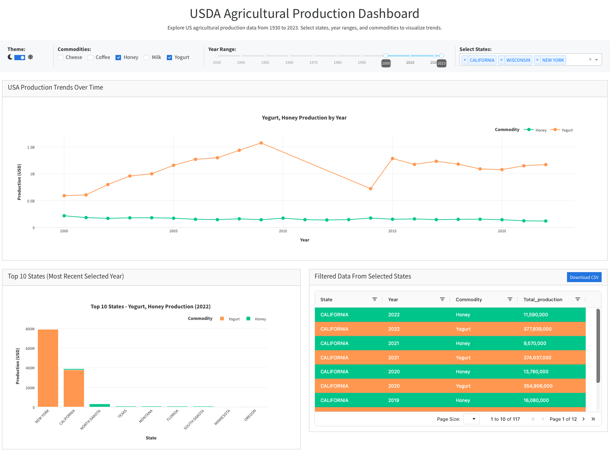
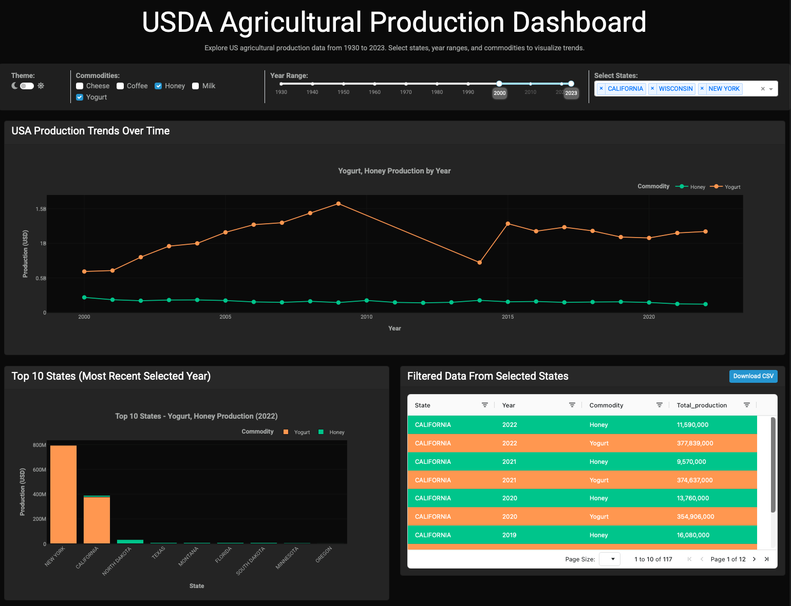

# USDA Commodities SQL Analytics Portfolio

This project analyzes USDA agricultural production data from 1930-2023 using
SQLite, SQL, Python, and Dash. The goal is to demonstrate end-to-end structured
data analysis: relational data modeling, data cleaning, SQL querying, trend
analysis, state-level ranking, and dashboard reporting.

## Dashboard Screenshots

### Light Theme



### Dark Theme



## How To Review This Project

1. Start with the SQL portfolio files in [`SQL/`](SQL/), especially the quality,
   CTE, window function, and ranking modules.
2. Read [`docs/project_summary.md`](docs/project_summary.md) for findings and
   limitations.
3. Check [`docs/schema.md`](docs/schema.md) and
   [`docs/data_dictionary.md`](docs/data_dictionary.md) for database context.
4. Open [`dashboard/app.py`](dashboard/app.py) only after reviewing the SQL that
   creates the dashboard-ready data.

## Skills Demonstrated

- SQL schema design and indexing
- Joins and subqueries
- CTE-based transformations
- Window functions for year-over-year and rolling trend analysis
- `CASE` logic for production categories and data quality flags
- `GROUP BY` and `HAVING` for state and commodity summaries
- Data cleaning and validation
- Long-format analytical modeling with `UNION ALL`
- Python and Dash dashboarding

## Business Questions Answered

The SQL modules answer questions such as:

1. Which commodities have the highest total production over the full dataset?
2. Which states are the top producers by commodity?
3. Which states have the most diverse commodity production profiles?
4. Which commodities have the widest state coverage?
5. Which state-commodity pairs have the highest production in the latest year?
6. Which states are missing production records for each commodity?
7. Which commodities have grown or declined most over time?
8. Which state-commodity pairs are unusual production outliers?
9. Which commodities are geographically concentrated?
10. Which records should be prioritized for deeper forecasting?

## Key Findings

- Milk is the largest production category by all-time total in the
  dashboard-ready annualized data, with roughly 11.7 trillion in total recorded
  production. Evidence:
  [`SQL/03_core_analysis_questions.sql`](SQL/03_core_analysis_questions.sql).
- Latest-year top producers are highly concentrated by commodity: California
  leads milk in 2023, Wisconsin leads cheese in 2023, North Dakota leads honey
  in 2022, New York leads yogurt in 2022, and Hawaii leads coffee in 2016.
  Evidence:
  [`SQL/06_state_commodity_rankings.sql`](SQL/06_state_commodity_rankings.sql).
- In April 2023 cheese production, only Wisconsin and California exceeded
  100 million in production. Evidence:
  [`SQL/06_state_commodity_rankings.sql`](SQL/06_state_commodity_rankings.sql).
- Coffee coverage is narrow in this dataset, with records only for Hawaii, so
  it should not be compared directly with national dairy patterns without
  calling out the coverage difference. Evidence:
  [`SQL/01_data_quality_checks.sql`](SQL/01_data_quality_checks.sql).
- The source tables include blank `State_ANSI` records in milk, cheese, and
  honey. The cleaned long-format view excludes those rows from state-level
  analysis because they cannot join to `state_lookup`. Evidence:
  [`SQL/01_data_quality_checks.sql`](SQL/01_data_quality_checks.sql).

## SQL Portfolio Files

| File | Purpose |
|---|---|
| [`SQL/00_schema.sql`](SQL/00_schema.sql) | Documents table structure, join keys, indexes, and the long-format analysis view. |
| [`SQL/01_data_quality_checks.sql`](SQL/01_data_quality_checks.sql) | Profiles row counts, missing keys, lookup mismatches, duplicates, coverage, and period handling. |
| [`SQL/02_cleaning_transformations.sql`](SQL/02_cleaning_transformations.sql) | Removes comma formatting and creates `commodity_production_long`. |
| [`SQL/03_core_analysis_questions.sql`](SQL/03_core_analysis_questions.sql) | Answers 10 business-style analytical questions. |
| [`SQL/04_cte_analysis.sql`](SQL/04_cte_analysis.sql) | Shows multi-step CTE analysis pipelines. |
| [`SQL/05_window_function_analysis.sql`](SQL/05_window_function_analysis.sql) | Uses `LAG`, rolling averages, ranks, percent contribution, and volatility logic. |
| [`SQL/06_state_commodity_rankings.sql`](SQL/06_state_commodity_rankings.sql) | Ranks states, segments production levels, and flags marketing priorities with `CASE`. |
| [`SQL/07_dashboard_export.sql`](SQL/07_dashboard_export.sql) | Regenerates the CSV shape consumed by the Dash dashboard. |
| [`SQL/99_legacy_original_queries.sql`](SQL/99_legacy_original_queries.sql) | Preserves the original exercise-style query script for reference. |

The original script remains available at
[`SQL/load_and_examine_USDA_data.sql`](SQL/load_and_examine_USDA_data.sql).

## Documentation

- [`docs/project_summary.md`](docs/project_summary.md)
- [`docs/data_dictionary.md`](docs/data_dictionary.md)
- [`docs/schema.md`](docs/schema.md)

## Project Structure

```text
data-science-USDA-commodities/
├── README.md
├── SQL_PORTFOLIO_IMPROVEMENT_PLAN.md
├── requirements.txt
├── dashboard_light.png
├── dashboard_dark.png
├── docs/
│   ├── data_dictionary.md
│   ├── schema.md
│   ├── schema_diagram.png
│   └── project_summary.md
├── SQL/
│   ├── project-USDA.sqlite
│   ├── 00_schema.sql
│   ├── 01_data_quality_checks.sql
│   ├── 02_cleaning_transformations.sql
│   ├── 03_core_analysis_questions.sql
│   ├── 04_cte_analysis.sql
│   ├── 05_window_function_analysis.sql
│   ├── 06_state_commodity_rankings.sql
│   ├── 07_dashboard_export.sql
│   ├── 99_legacy_original_queries.sql
│   ├── USDA_production_2023.csv
│   └── raw commodity CSV files
└── dashboard/
    ├── app.py
    └── requirements.txt
```

## Input Data

### Data Source

USDA agricultural production statistics spanning 1930-2023.

### Raw Data Files

| Dataset | Records | Description |
|---|---:|---|
| `milk_production.csv` | 37,638 | Monthly and annual milk production by state |
| `cheese_production.csv` | 7,488 | Monthly and annual cheese production by state |
| `honey_production.csv` | 1,559 | Annual honey production by state |
| `coffee_production.csv` | 71 | Annual coffee production with limited state coverage |
| `yogurt_production.csv` | 149 | Annual yogurt production by state |
| `state_lookup.csv` | 50 | State ANSI code reference |

## Reproduce The Analysis

Run the SQL files against the included SQLite database:

```bash
sqlite3 SQL/project-USDA.sqlite < SQL/01_data_quality_checks.sql
sqlite3 SQL/project-USDA.sqlite < SQL/02_cleaning_transformations.sql
sqlite3 SQL/project-USDA.sqlite < SQL/03_core_analysis_questions.sql
sqlite3 SQL/project-USDA.sqlite < SQL/04_cte_analysis.sql
sqlite3 SQL/project-USDA.sqlite < SQL/05_window_function_analysis.sql
sqlite3 SQL/project-USDA.sqlite < SQL/06_state_commodity_rankings.sql
```

Regenerate the dashboard CSV from SQLite:

```bash
sqlite3 SQL/project-USDA.sqlite
```

Then run these commands inside the SQLite shell:

```sql
.headers on
.mode csv
.once SQL/USDA_production_2023.csv
.read SQL/07_dashboard_export.sql
```

## Running The Dashboard

Install dependencies:

```bash
python -m pip install -r requirements.txt
```

Run the application:

```bash
cd dashboard
python app.py
```

Open `http://localhost:1234`.

## Dashboard Features

- Light and dark theme toggle
- Commodity multi-select
- Year range slider
- State multi-select
- Production trend line chart
- Top 10 states bar chart
- Filtered data table
- CSV download

## Data Pipeline

```text
Raw CSV files
    -> SQLite source tables
    -> SQL data quality checks
    -> SQL cleaning and commodity_production_long view
    -> SQL dashboard export
    -> USDA_production_2023.csv
    -> Dash dashboard
```

## Known Limitations

- USDA source units vary by commodity, so cross-commodity totals should be read
  carefully.
- Milk and cheese include both monthly and annual records. The dashboard export
  uses monthly records for annualized totals and excludes `YEAR` records to
  avoid double counting.
- Coffee and yogurt have narrower state coverage than milk, cheese, and honey.
- Some raw source rows contain blank state codes and are excluded from
  state-level analysis.
