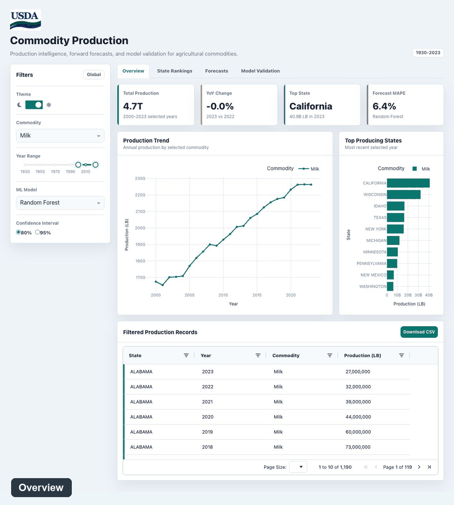

# USDA Commodity Production Analytics Portfolio

[](https://github.com/vuoanh/data-science-pofolio/actions/workflows/ci.yml)

This project analyzes USDA agricultural production data from 1930-2023 using
SQLite, SQL, Python, machine learning, and Dash. The goal is to demonstrate an
end-to-end analytics workflow: USDA bulk-data ingestion, relational data
modeling, SQL analysis, forecasting feature engineering, model validation, and
business-facing dashboard reporting.

## Dashboard Preview



## Current Dashboard Workflow

The dashboard is designed as a business review tool for one selected commodity
at a time, while always showing all available states for that commodity.

1. **Overview**: review production KPIs, year-over-year movement, the current
   top producing state, model error, production trends, and the filtered record
   table.
2. **State Rankings**: compare all states for the selected commodity in the
   latest selected year, including concentration/share of national production.
3. **Forecasts**: choose a machine learning model and confidence interval, then
   review direct next-year forecasts from each state's latest available
   observation.
4. **Model Validation**: compare actual vs predicted production, residuals over
   time, forecast misses, and model accuracy before trusting forward forecasts.

Global filters now focus on the decision flow: light/dark theme, single
commodity, year range, ML model, and confidence interval. The previous state
selector was removed so the dashboard consistently presents the full all-state
market view.

## How To Review This Project

1. Watch the dashboard preview above to understand the product experience.
2. Read [`docs/project_summary.md`](docs/project_summary.md) for findings,
   assumptions, and limitations.
3. Review the SQL portfolio files in [`SQL/`](SQL/), especially the quality,
   CTE, window function, and ranking modules.
4. Check [`docs/schema.md`](docs/schema.md) and
   [`docs/data_dictionary.md`](docs/data_dictionary.md) for database context.
5. Review [`docs/forecasting_model_summary.md`](docs/forecasting_model_summary.md)
   and the model artifacts in [`models/`](models/).
6. Open [`dashboard/app.py`](dashboard/app.py) to see how the data, forecasts,
   validation outputs, and business dashboard are connected.

## Skills Demonstrated

- SQL schema design and indexing
- Joins and subqueries
- CTE-based transformations
- Window functions for year-over-year and rolling trend analysis
- `CASE` logic for production categories and data quality flags
- `GROUP BY` and `HAVING` for state and commodity summaries
- Data cleaning and validation
- Long-format analytical modeling with `UNION ALL`
- Public USDA bulk-data ingestion and source reconciliation
- Forecasting feature engineering
- Random Forest and XGBoost model comparison
- Time-based model validation against simple baselines
- Prediction intervals and direct forward forecasts
- Business-oriented Dash dashboarding with light/dark themes

## Business Questions Answered

The SQL modules answer questions such as:

1. Which commodities have the highest total production over the full dataset?
2. Which states are the top producers by commodity?
3. Which states have the most diverse commodity production profiles?
4. Which commodities have the widest state coverage?
5. Which state-commodity pairs have the highest production in the latest year?
6. Which states are missing production records for each commodity?
7. Which commodities have grown or declined most over time?
8. Which state-commodity pairs are unusual production outliers?
9. Which commodities are geographically concentrated?
10. Which records should be prioritized for deeper forecasting?

## Key Findings

- Milk is the largest category in the refreshed dashboard-ready data, with
  roughly 13.5 trillion pounds of recorded state-level production from
  1930-2023.
- Latest-year top producers are concentrated by commodity: California leads
  milk in 2023, Wisconsin leads cheese in 2023, North Dakota leads honey in
  2023, New York leads yogurt in 2023, and Hawaii leads coffee in 2023.
- The refreshed 2023 coverage is broader than the original project extract:
  milk has 48 state rows, honey has 39, cheese has 13, yogurt has 2, and coffee
  has 1.
- The USDA bulk refresh updated the dashboard/model dataset from 5,027 rows to
  7,477 rows. The comparison summary is saved in
  [`data/processed/usda_1930_2023_existing_vs_bulk_summary.csv`](data/processed/usda_1930_2023_existing_vs_bulk_summary.csv).
- Units are consistent within commodity: milk, cheese, honey, and yogurt are in
  pounds, while coffee is reported in pounds on a cherry-basis measure.

## Forecasting Model

The project includes a supervised forecasting layer that predicts next-year
production for each `State` and `commodity` pair. Random Forest and XGBoost
are now trained as separate commodity-specific models so Milk, Honey, Coffee,
Cheese, and Yogurt no longer share one global error pattern.

Modeling artifacts:

- [`src/build_features.py`](src/build_features.py)
- [`src/train_model.py`](src/train_model.py)
- [`src/generate_forecasts.py`](src/generate_forecasts.py)
- [`src/evaluate_model.py`](src/evaluate_model.py)
- [`docs/forecasting_model_summary.md`](docs/forecasting_model_summary.md)

Dashboard-facing outputs:

- `models/test_predictions.csv`: backtest predictions, residuals, and
  prediction intervals used by the Model Validation tab.
- `models/latest_forecasts.csv`: latest direct forecasts for each available
  state/commodity pair used by the Forecasts tab.
- `models/by_commodity/<commodity>/random_forest.joblib` and
  `models/by_commodity/<commodity>/xgboost.joblib`: trained
  commodity-specific pipelines. The dashboard no longer depends on one global
  Random Forest or XGBoost model file.

Models compared:

- previous-year baseline
- rolling 3-year baseline
- Random Forest
- XGBoost

The split is time-based: training target years are `<= 2018`, and test target
years are `>= 2019`.

| Model | MAE | RMSE | MAPE | R2 |
|---|---:|---:|---:|---:|
| Previous-year baseline | 53,547,189 | 145,148,329 | 14.48% | 0.999 |
| Rolling 3-year baseline | 91,395,960 | 253,803,495 | 14.18% | 0.998 |
| Random Forest | 95,637,996 | 299,652,379 | 13.07% | 0.997 |
| XGBoost | 91,818,392 | 288,924,673 | 12.78% | 0.998 |

Result: the previous-year baseline remains strongest overall by MAE and RMSE,
but commodity-specific XGBoost is now the strongest ML benchmark. This is a
useful data science finding because annual production is highly persistent, so
the ML models need to be judged against simple baselines rather than in
isolation.

## SQL Portfolio Files

| File | Purpose |
|---|---|
| [`SQL/00_schema.sql`](SQL/00_schema.sql) | Documents table structure, join keys, indexes, and the long-format analysis view. |
| [`SQL/01_data_quality_checks.sql`](SQL/01_data_quality_checks.sql) | Profiles row counts, missing keys, lookup mismatches, duplicates, coverage, and period handling. |
| [`SQL/02_cleaning_transformations.sql`](SQL/02_cleaning_transformations.sql) | Removes comma formatting and creates `commodity_production_long`. |
| [`SQL/03_core_analysis_questions.sql`](SQL/03_core_analysis_questions.sql) | Answers 10 business-style analytical questions. |
| [`SQL/04_cte_analysis.sql`](SQL/04_cte_analysis.sql) | Shows multi-step CTE analysis pipelines. |
| [`SQL/05_window_function_analysis.sql`](SQL/05_window_function_analysis.sql) | Uses `LAG`, rolling averages, ranks, percent contribution, and volatility logic. |
| [`SQL/06_state_commodity_rankings.sql`](SQL/06_state_commodity_rankings.sql) | Ranks states, segments production levels, and flags marketing priorities with `CASE`. |
| [`SQL/07_dashboard_export.sql`](SQL/07_dashboard_export.sql) | Regenerates the CSV shape consumed by the Dash dashboard. |

## Documentation

- [`docs/project_summary.md`](docs/project_summary.md)
- [`docs/data_dictionary.md`](docs/data_dictionary.md)
- [`docs/schema.md`](docs/schema.md)
- [`docs/forecasting_model_summary.md`](docs/forecasting_model_summary.md)

## Project Structure

```text
data-science-USDA-commodities/
├── README.md
├── requirements.txt
├── dashboard_preview.gif
├── data/
│   ├── raw/
│   │   └── usda_quickstats_bulk_1930_2023_project_production.csv
│   └── processed/
│       ├── forecasting_features.csv
│       ├── usda_production_1930_2023_complete.csv
│       ├── usda_production_1930_2023_coverage_summary.csv
│       ├── usda_1930_2023_existing_vs_bulk_summary.csv
│       └── usda_bulk_refresh_manifest.json
├── docs/
│   ├── data_dictionary.md
│   ├── schema.md
│   ├── schema_diagram.png
│   ├── project_summary.md
│   └── forecasting_model_summary.md
├── models/
│   ├── model_metrics.json
│   ├── feature_importance.csv
│   ├── latest_forecasts.csv
│   ├── test_predictions.csv
│   └── by_commodity/
│       ├── cheese/
│       ├── coffee/
│       ├── honey/
│       ├── milk/
│       └── yogurt/
├── src/
│   ├── build_features.py
│   ├── evaluate_model.py
│   ├── generate_forecasts.py
│   ├── refresh_usda_bulk_data.py
│   └── train_model.py
├── tests/
│   ├── conftest.py
│   ├── test_build_features.py
│   ├── test_evaluate_model.py
│   └── test_generate_forecasts.py
├── .github/
│   └── workflows/
│       └── ci.yml
├── SQL/
│   ├── project-USDA.sqlite
│   ├── 00_schema.sql
│   ├── 01_data_quality_checks.sql
│   ├── 02_cleaning_transformations.sql
│   ├── 03_core_analysis_questions.sql
│   ├── 04_cte_analysis.sql
│   ├── 05_window_function_analysis.sql
│   ├── 06_state_commodity_rankings.sql
│   ├── 07_dashboard_export.sql
│   ├── USDA_production_2023.csv
│   └── raw commodity CSV files
└── dashboard/
    ├── app.py
    └── requirements.txt
```

## Input Data

### Data Source

USDA NASS QuickStats public bulk exports spanning 1930-2023 for the project
commodities.

### Refreshed Data Files

| Dataset | Records | Description |
|---|---:|---|
| `data/raw/usda_quickstats_bulk_1930_2023_project_production.csv` | 7,724 | Filtered QuickStats bulk rows before latest-load-time deduplication |
| `data/processed/usda_production_1930_2023_complete.csv` | 7,477 | Audit-rich annual state-level production dataset |
| `SQL/USDA_production_2023.csv` | 7,477 | Dashboard/model-ready canonical production dataset |
| `data/processed/usda_production_1930_2023_coverage_summary.csv` | 225 | Coverage summary by year and commodity |
| `state_lookup.csv` | 50 | State ANSI code reference |

## Reproduce The Analysis

Run the SQL files against the included SQLite database:

```bash
sqlite3 SQL/project-USDA.sqlite < SQL/01_data_quality_checks.sql
sqlite3 SQL/project-USDA.sqlite < SQL/02_cleaning_transformations.sql
sqlite3 SQL/project-USDA.sqlite < SQL/03_core_analysis_questions.sql
sqlite3 SQL/project-USDA.sqlite < SQL/04_cte_analysis.sql
sqlite3 SQL/project-USDA.sqlite < SQL/05_window_function_analysis.sql
sqlite3 SQL/project-USDA.sqlite < SQL/06_state_commodity_rankings.sql
```

Refresh the canonical dashboard/model dataset from public USDA bulk exports:

```bash
curl -L -o /private/tmp/qs.animals_products_20260605.txt.gz \
  https://www.nass.usda.gov/datasets/qs.animals_products_20260605.txt.gz
curl -L -o /private/tmp/qs.crops_20260605.txt.gz \
  https://www.nass.usda.gov/datasets/qs.crops_20260605.txt.gz

python src/refresh_usda_bulk_data.py \
  --bulk-path /private/tmp/qs.animals_products_20260605.txt.gz \
              /private/tmp/qs.crops_20260605.txt.gz \
  --start-year 1930 \
  --end-year 2023
```

Build forecasting features and train models:

```bash
python src/build_features.py
python src/train_model.py
python src/generate_forecasts.py
```

## Running The Dashboard

Install dependencies:

```bash
python -m pip install -r requirements.txt
```

Run the application:

```bash
cd dashboard
python app.py
```

Open `http://localhost:1234`.

## Testing

The forecasting pipeline is covered by a `pytest` suite that pins the
contracts most prone to silent breakage:

- **Leakage guard** — every training row's `target_year` must equal `Year + 1`;
  multi-year gaps are excluded so the model only learns true one-year-ahead
  forecasts.
- **Feature correctness** — lag, rolling-mean, and target values are checked
  against hand-computed series.
- **Forward features** — exactly one row per state/commodity at its latest year,
  with no target column leaking in.
- **Metrics and intervals** — MAE/RMSE/MAPE/R2, residual and tree-quantile
  prediction intervals, and empirical coverage math.
- **Recency filter** — states that exited production are dropped from forward
  forecasts.

Install dev dependencies and run the suite:

```bash
python -m pip install -r requirements-dev.txt
pytest
```

Tests run automatically on every push and pull request via GitHub Actions
(`.github/workflows/ci.yml`) on Python 3.11 and 3.12.

## Dashboard Features

- Light and dark theme toggle
- Single-commodity workflow for cleaner model comparison
- Year range slider
- ML model selector for Random Forest vs XGBoost forecasts
- Confidence interval selector for 80% vs 95% bands
- Overview tab with KPI cards, production trend, top states, and data table
- State Rankings tab for all-state benchmarking and production concentration
- Forecasts tab with latest direct forecasts and confidence bands
- Model Validation tab with actual vs predicted production, residuals, and
  largest forecast misses
- CSV download for filtered production records

## Data Pipeline

```text
USDA QuickStats bulk exports
    -> src/refresh_usda_bulk_data.py
    -> filtered project raw extract
    -> audit-rich processed annual dataset
    -> SQL/USDA_production_2023.csv
    -> data/processed/forecasting_features.csv
    -> commodity-specific Random Forest and XGBoost models
    -> models/test_predictions.csv and models/latest_forecasts.csv
    -> Dash dashboard overview, rankings, forecasts, and validation tabs
```

## Known Limitations

- USDA source units vary by commodity, so cross-commodity totals should be read
  carefully.
- The refreshed canonical dataset is annual state-level production. Some legacy
  SQL exercises still use the original SQLite/raw monthly tables for
  month-specific questions.
- Coffee and yogurt have narrower state coverage than milk, cheese, and honey.
- Rows with blank state codes or USDA `OTHER STATES` rollups are excluded from
  the refreshed state-level dataset.
