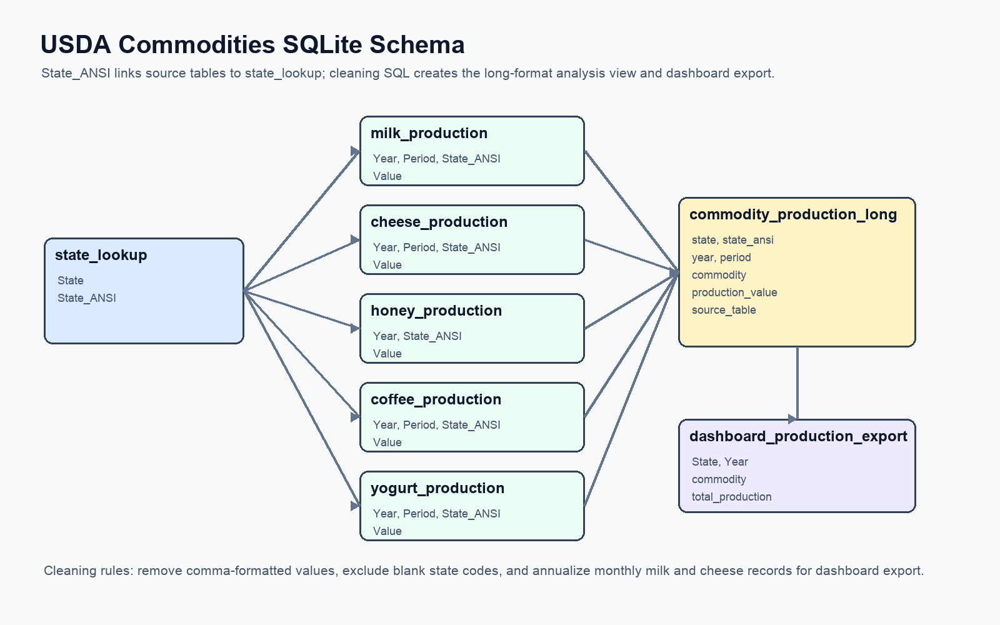
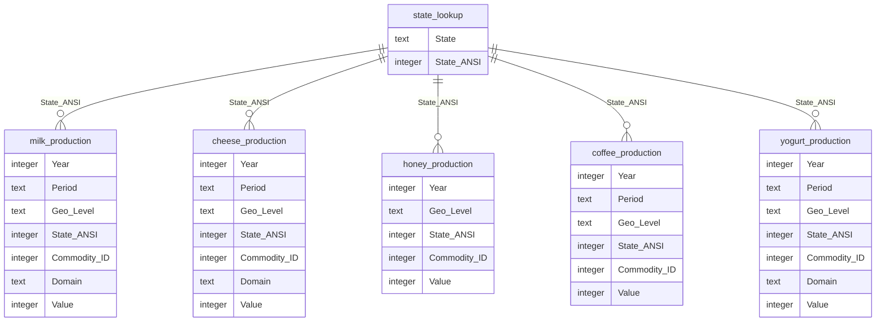

# Schema

The SQLite database uses a simple star-style analytical structure. Commodity
production tables store source records, and `state_lookup` provides the shared
state name and ANSI code reference. The cleaned analytical surface is
`commodity_production_long`, a long-format view that standardizes commodity
labels, production values, and period handling.

## Table Relationships

`State_ANSI` is the join key between `state_lookup` and each commodity table.
This keeps the raw commodity files separate while still allowing consistent
state names in analysis queries and the dashboard.

The project deliberately keeps commodity source tables separate because each
USDA extract has slightly different coverage:

- Milk and cheese include monthly records plus `YEAR` summary records.
- Honey does not include a `Period` column and is treated as annual.
- Coffee and yogurt use `YEAR` period records in this dataset.

`SQL/02_cleaning_transformations.sql` creates `commodity_production_long` by
joining source rows to `state_lookup`, assigning a commodity label, normalizing
periods, removing comma formatting from values, and adding `source_table` for
lineage.

## Dashboard Relationship

The Dash app reads `SQL/USDA_production_2023.csv`. The current canonical file
is generated by
[`src/refresh_usda_bulk_data.py`](../src/refresh_usda_bulk_data.py) from USDA
QuickStats public bulk exports.

[`SQL/07_dashboard_export.sql`](../SQL/07_dashboard_export.sql) is retained as
the legacy SQLite export used by the SQL portfolio exercises. That export uses
annualized production totals with these rules:

- Milk and cheese: sum monthly records and exclude `YEAR` records to avoid
  double counting.
- Honey, coffee, and yogurt: use `YEAR` records.

## Known Schema Limitations

- The SQLite database is analysis-oriented, not a transactional production
  schema.
- Some source rows contain blank `State_ANSI` values. These are profiled in
  [`SQL/01_data_quality_checks.sql`](../SQL/01_data_quality_checks.sql) and
  excluded from state-level long-format analysis because they cannot be matched
  to a state.
- Production units vary by commodity in USDA source data, so cross-commodity
  totals should be interpreted as portfolio-style SQL examples, not strict
  unit-equivalent comparisons.
